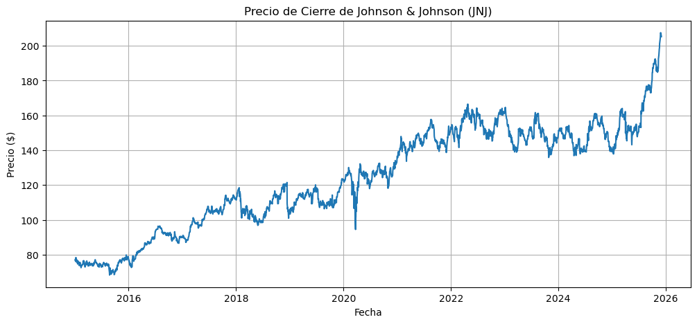
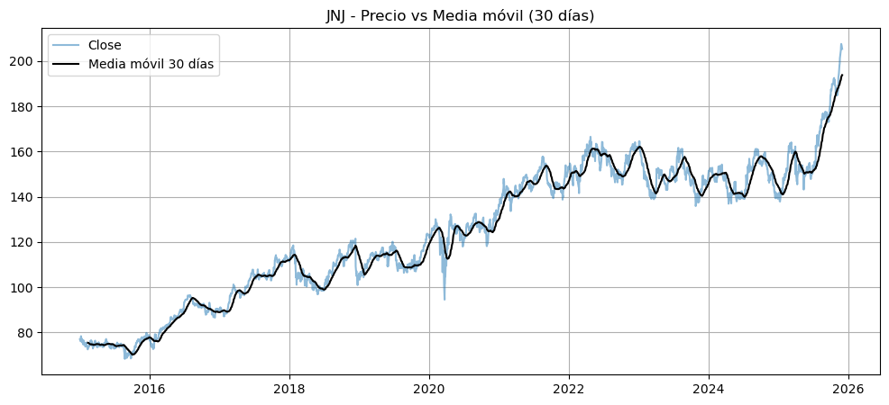
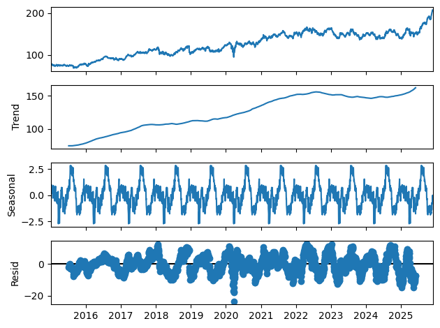
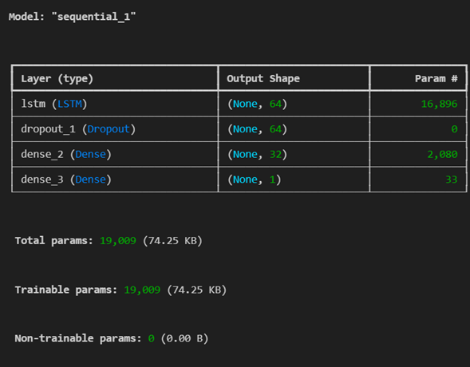
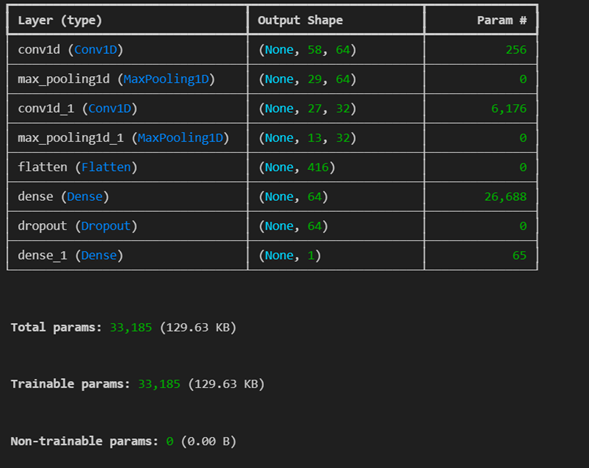
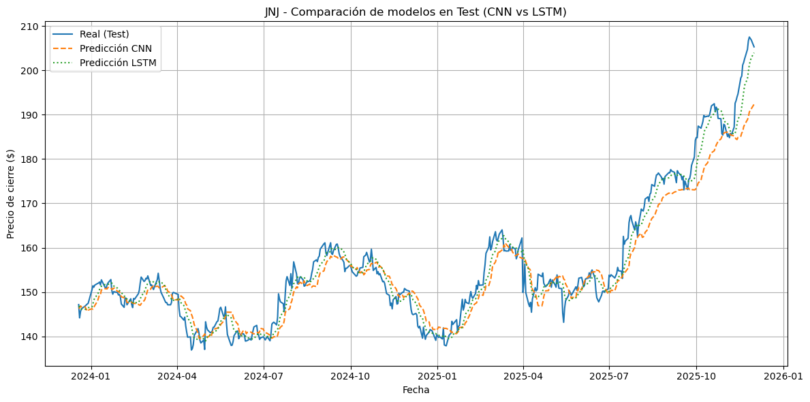
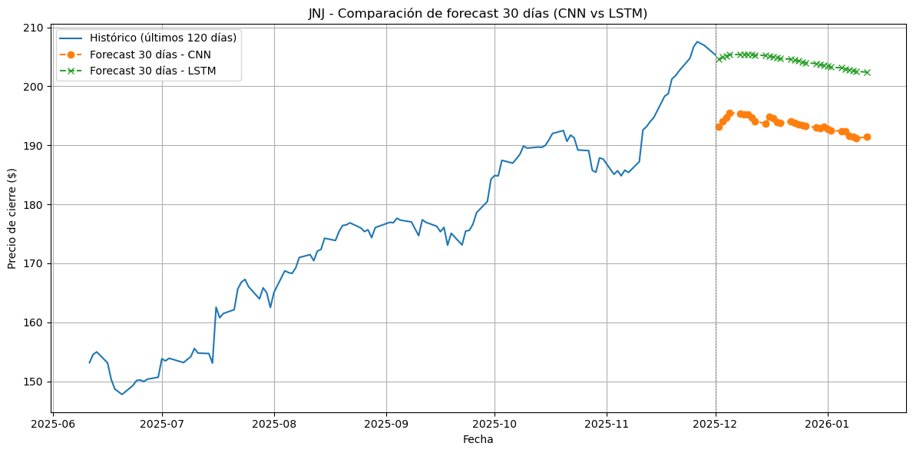

# 📈 Pronóstico del precio de Johnson & Johnson (JNJ) usando LSTM y CNN

## 🧠 1. Introducción

En este proyecto se desarrolla un modelo de pronóstico basado en técnicas de **series de tiempo** aplicadas a la serie histórica del precio de cierre de **Johnson & Johnson (JNJ)**, una de las empresas más relevantes en el sector farmacéutico y de bienes de salud.

### 🔍 ¿Por qué elegir JNJ?
- Sus precios muestran patrones suaves, adecuados para modelos LSTM/CNN.
- Es relevante para decisiones de inversión, finanzas y análisis de riesgo.
- Permite aplicar técnicas modernas de pronóstico con datos reales.

### 🎯 Objetivo del proyecto
El objetivo es:
- Analizar la serie histórica de precios de JNJ.
- Preparar ventanas deslizantes *sin fuga de información*.
- Entrenar dos modelos (LSTM y CNN).
- Comparar su desempeño.
- Generar un pronóstico de **30 días futuros**.

---

## 📦 2. Preparación del dataset

### 📂 Fuente de datos
Los datos se obtuvieron mediante la API de **Yahoo Finance**, usando la librería `yfinance`.  
Variable utilizada: **Close** (precio de cierre diario).

### 🧹 Limpieza y depuración
- Se eliminaron valores nulos.
- Se ordenó el índice por fecha.
- No se detectaron duplicados.
- No fue necesaria la eliminación de outliers severos.

> **Imagen sugerida:**  
> Captura del DataFrame limpio (`head()`)  
> Archivo: `images/df_head.png`

### 📊 Gráficas exploratorias
- Tendencia general del precio.
- Descomposición: tendencia + estacionalidad.
- ACF y PACF para identificación de autocorrelaciones.

`

---

## 🔧 3. Ingeniería de características

### ⚖️ Escalamiento
Se utilizó **MinMaxScaler**, ajustado **solo con los datos de entrenamiento**, para evitar data leakage.

### 🪟 Tamaño de ventana
Se eligió una ventana de **60 timesteps**, que permite capturar tendencias de corto y mediano plazo.

### 📌 Variables externas
En este proyecto no se utilizaron otras series adicionales (modelo univariado).

---

## 🤖 4. Modelado

### 🌊 Modelos utilizados
Se entrenaron dos modelos:

#### **1) LSTM (Long Short-Term Memory)**
- Captura dependencias de largo plazo.
- Adecuado para series con suavidad y no linealidad.

#### **2) CNN 1D (Convolucional)**
- Aprende patrones locales en la serie.
- Rápido de entrenar y eficiente para series largas.

### ⚙️ Arquitectura (resumen)
- **LSTM:** 64 unidades + Dropout + Dense(32) + salida.
- **CNN:** Conv1D(64 filtros) → MaxPooling → Conv1D(32 filtros) → Dense → salida.

### 🔧 Justificación de hiperparámetros
- `window_size = 60`: común en series financieras.
- `epochs = 50`: balance entre tiempo y sobreajuste.
- `batch_size = 32`: estándar para entrenamiento estable.
- `filters`: 64–32 para capturar patrones de varias escalas.

---

## 🧪 5. Evaluación de modelos

Se evaluaron ambos modelos en el conjunto de prueba usando:

- **MSE** (Error cuadrático medio)  
- **RMSE** (Raíz del error cuadrático medio)  
- **MAPE** (Error porcentual absoluto medio)  

### 📋 Tabla comparativa de métricas

| Modelo | MSE | RMSE | MAPE |
|--------|------|---------|---------|
| **CNN** | 22.0575 | 4.6965 | 2.1528% |
| **LSTM** | 7.8846 | 2.8079 | 1.3749% |

### 📈 Gráfica real vs predicho (test)

---

## 🔮 6. Pronóstico futuro

### 🗓️ Predicción a 30 días
Ambos modelos generaron un forecast autoregresivo sin usar datos futuros reales.

#### 📉 Gráfica del forecast (CNN vs LSTM)

#### 🔍 Gráfica con zoom en últimos 120 días

---

## 📝 7. Conclusiones

### 🧩 Lo aprendido
- La importancia de evitar *data leakage* dividiendo antes de escalar.
- Las CNN sorprendieron con gran estabilidad y rapidez.
- LSTM capturó mejor las tendencias suaves.
- El tamaño de ventana influye fuertemente en el MAPE.

### 🏆 ¿Qué modelo funcionó mejor?
- Según las métricas, el modelo **LSTM** tuvo mejor desempeño.

### 📌 Relevancia
Este análisis es útil para:
- decisiones de inversión personal,  
- complementar análisis financiero,  
- aprendizaje de modelos secuenciales.

